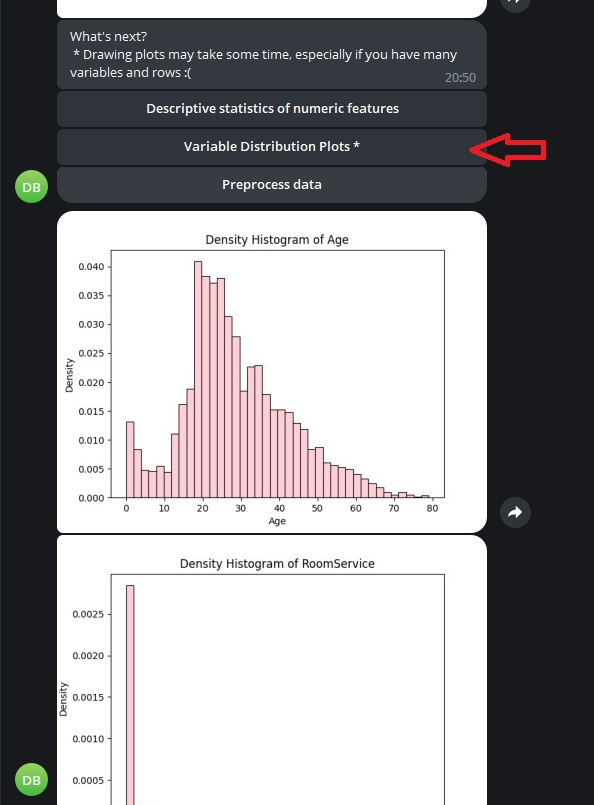

# DATASET_REVIEW_BOT

    Chat bot in Telegram messenger which can analyze your datasets. 

This bot is made using python-telegram-bot library (https://github.com/python-telegram-bot/python-telegram-bot).
 
 
## Features of the bot
1) Primary data observation (number of rows/variables, variables divided into categories based on data type, missing values detection)
2) Descriptive statistics of numeric features (count, mean, std, min, 25%, 50%, 75%, max)
3) Drawing distribution plots of numeric data and countplots of categorical data
4) Data preprocessing (imputation based on mode/median, deleting features with too little info, specifically >70% missing values or >30 unique categorical values per thousand)
5) Correlation analysis (Pearson or Spearman)
6) 2-samples comparison (using t-test or Manna-Whitney)  
 
 

## Usage of the bot
*Link to the bot: https://t.me/dataset_review_bot

*Please, take in consideration that this bot is not on server and is launched locally from my PC! So, in order to test it yorself, please contact me via email or via Telegram.  
email: sahappleid@yandex.ru  
tg: @to505to505  
 
Moreover, bot token is written in main1.py, so if your venv meet the requirments written in **requirments.txt** you can try this code yourself on your Pc. 
 
 
## Example of dataset analysis by bot 

The dataset used in the following example is a test.csv dataset from Spaceship Titanic Kaggle Competition (https://www.kaggle.com/competitions/spaceship-titanic). You can find it in my repository as well under the name **test_example.csv** 
 
### 1) Start the bot and send dataset 
We receive primary data observation 

 
 
### 2) Get descriptive statistics of numeric features 
We receive descriptive statistics in a JPEG file (if there are many numeric variables there will be several images with descriptive statistics) 
 

 
 

 
 
### 3) Get variables distribution plots 
We receive distribution plots of all numeric features and countplots of all categorical variables as JPEG files 
 

 
 

 
 
### 4) Preprocess data  
In order to conduct statistical tests we need to preprocess our data (at least imputate missing values).
After preprocessing, we see that missing values have been imputated, and features with too little information have been deleted. In this dataset there aren't many missing values, so no features have been deleted based on "too many missing values" criteria. Nevertheless, 'text' features with too many unique values have been removed.  
 
 

 
 

### 5) Conduct correlation analysis 
After we pressed Correlation analysis, we can choose which correlation coefficient to use. Let's use Spearman because we saw that variables distributions looked nothing like normal. Even though in a real project correlation coefficient should be chosen much more precisely, we just want to review our dataset quickly so we don't need to put much time in to make an accurate choice. 
 

 
 

### Observing results of correlation analysis 
We receive correlation matrix in JPEG and 2 csv files: correlation matrix and p-value matrix.
By looking at the correlation matrix we already can observe that, for example, FoodCourt and VRDeck are strognly correlated, as well as FoodCourt and Spa. In p-values csv file we see that all our correlations are statistically significant.  
 

 
 
 

 

 

 
 

### 6) Conduct 2-sample comparison 
Now let's conduct 2-samples comparison. Here we can also choose between t-test and Manna-Whitney. We chose Spearman correaltion last time so let's continue with non-parametric. 
 

 
 

 
 

### Pick a binary feature and see the results 
As we need to divide our data in 2 samples in order to compare them, we must choose a binary feature, based on which we will split our sample. Let's choose VIP and see the results in a table in a csv file.
 

 
 
Well, we see that people with VIP status are older and spend more money on all sort of activities. (Features like SPA, VRDeck, ShoppingMall, etc. represent how much money people spend on this things https://www.kaggle.com/competitions/spaceship-titanic/data). That sounds about right!
 
 

 
 
 
 
Made by Dmitrii Sakharov

